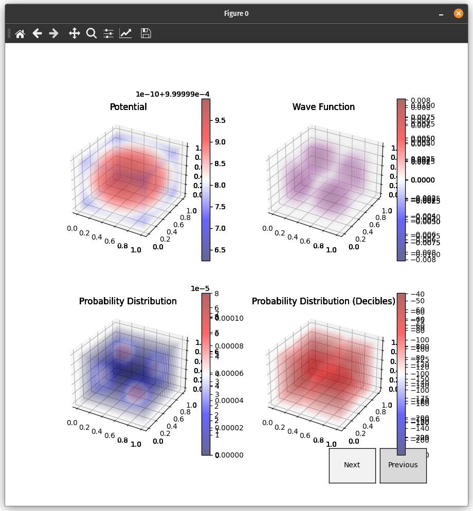

# Methods: 
Uses the `Numerov` technique of discretizing a second the second derivative of a seond order ordinary differential equation with no first derivative. This is important for equations like the schrodinger equation, which do not always have an analytic solution, but do have a numerical one. The problem is most simulation techniques (Euler, Runge-Kutta) require the first order derivative, thus they can be used to time-evolve a known steady state of the schrodinger equation, but can not find a solution in space without an analytic solution. The two most popular methods to resolve this are the Numerov method (here) and the Transfer Matrix Method. This simulation solves for an eigen function using CuPy's GPU accelerated `eigsh` (SciPy can be substituted for CPU). The discretized second order derivative is encoded into this sparse matrix along a diagonal ((N^3)x(N^3)) and added into the potential term (encoded into an (N^3)x(N^3) matrix). The matrix is NxNxN. There is a null boundry condition surrounding the cubic area on all sides. Lower dimension (2D, 1D, NxN, and 1xN respectivley), simulations can be done as well, currently graphing these is not explicitly supported. However there are 3 ways to graph 3d simulations, one can scroll through 2D layer images, Matplotlib can be used, and presently GPU accelerated 3D plotting is in progress.

## Tutorials and References: 
Tutorials and References for configuring the N-dimensional discrete hamiltonian operator can be found at these links: 
- 1D [Eigenstates of ANY 1D Potential in PYTHON](https://youtu.be/ay0zZ8SUMSk) (Video, Mr. P Solver, YouTube)
- 1D [1.5: Numerically Solving the Schrödinger Equation](https://chem.libretexts.org/Bookshelves/Physical_and_Theoretical_Chemistry_Textbook_Maps/Time_Dependent_Quantum_Mechanics_and_Spectroscopy_(Tokmakoff)/01:_Overview_of_Time-Independent_Quantum_Mechanics/1.05:_Numerically_Solving_the_Schrodinger_Equation) (Time Dependent Quantum Mechanics and Spectroscopy (Andrei Tokmakoff), Libre Texts)
- 2D [2D Schrodinger Equation Numerical Solution in PYTHON](https://youtu.be/DF1SnjXZcbM) (Video, Mr. P Solver, YouTube)
- 3D [Solving 3D Time Independent Schrodinger Equation Using Numerical Method](http://dx.doi.org/10.13140/RG.2.2.13878.01602/1) (Pre - Print Paper, Wai Kui Wong)
- There are an number [Libre Texts](https://libretexts.org/)' submissions for how to do this as well, mostly texts relating to quantum chemistry and sometimes more direct physics 

## Advice/Tips/Tricks/Suggestions: 
- This is not ready for use by others
- If you want to attempt doing this yourself I reccomend following the above tutorials and going from 1D to 2D to 3D, the jump from one to the other is relativley straightforward. I started in Jupyter Notebook, the computation times on the CPU for 1D and 2D around `N = 150` are reasonable and you can use SciPy for that. When going to 3D compute time goes up exponentially and I reccomend considering GPU acceleration. If you used [SciPy](https://scipy.org/) I reccomend moving to [CuPy](https://cupy.dev/) if you have an NVIDIA GPU, however I see they are adding experimental support for AMD GPU's.
- Matplotlib often takes longer to plot than it actually takes to compute the schrodinger equation on my machine because it is using software-based graphics (I assume). However plotting is much faster and easier to explore the data with something GPU accelerated/interactive. Many people say the only alternative is [VisPy](https://vispy.org/) (which is still in development at the time of writing `December 2022`) while it looks promising it does not yet have support for plots of this type. [pyqtgraph](https://www.pyqtgraph.org/) is also GPU accelerated and has plotting widgets which do not requrire low-level graphic's API control. I reccomend matplotlib for publication, but while exploring the data, I reccomend pyqtgraph for the time being. The documentation is a bit rough, however you can A: check my example, B: they have a very nice example program (once installed type `python -m pyqtgraph.examples` which lets you modify the code for several examples (including a quantum mechanichal simulation of a hydrogen atom for the exact type of plot I am using the exact type of `Item` I used [`GLVolumeItem`](https://pyqtgraph.readthedocs.io/en/latest/api_reference/3dgraphics/glvolumeitem.html))
- There is an accessability gap here, there are several packages out that implement the underlying functions for `eigsh` (which takes the most time), and good matrix libraries like Eigen, but these packages are mostly CPU based. The original package still used by SciPy is ARPACK (written in FORTRAN 90, there is a C++ re-write (not a wrapper) called [Spectra](https://github.com/yixuan/spectra), it is easier to understand than FORTRAN) and libraries that do have a GPU implmentation of these routines they are somewhat vendor locked (as far as I can tell). It would be great if there were a GPU version written in a modern language (like C++, Rust, Zig, GLSL, or HLSL) with high-quaility code that was more platform independant. I think this could be done with compute shaders in [Vulkan](https://www.vulkan.org/), [WebGPU](https://gpuweb.github.io/gpuweb/), [wgpu](https://wgpu.rs/), etc. Compiling to [SPIRV](https://www.khronos.org/opengl/wiki/SPIR-V) and standardizing the attributtes may also be a portable solution

# Screenshots: 
## Matplotlib

## GPU Accelerated (pyqtgraph)

